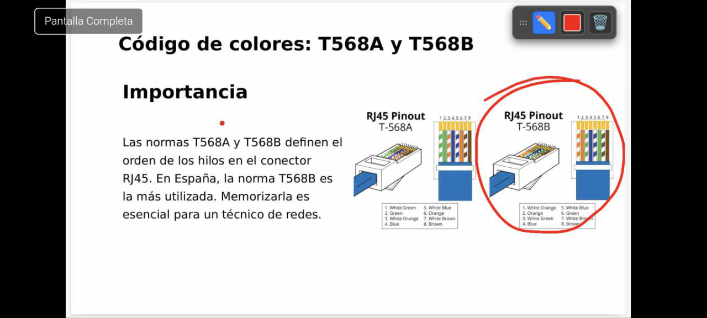

# 🖥️ Emisor de Pantalla

Herramienta ligera para transmitir el escritorio a otros dispositivos en la misma red local (LAN) utilizando un navegador web.



## Características

*   **Sin instalaciones extra:** El receptor solo necesita un navegador web moderno.
*   **Multiplataforma y Arquitectura:** Funciona nativamente en Windows, Linux, macOS (Intel y Apple Silicon) y dispositivos ARM como Raspberry Pi.
*   **Feedback visual:** Muestra un indicador naranja al hacer clic para facilitar el seguimiento.
*   **Interactivo:** El receptor puede dibujar sobre la transmisión (lápiz digital).
*   **Configurable:** Consumo de recursos ajustable (calidad y FPS).

## Caso de Uso Principal

Este proyecto fue concebido para su uso en aulas con **PDIs (Pizarras Digitales Interactivas)**.

Permite al docente enviar la señal de su ordenador a la PDI simplemente abriendo una URL en el navegador de la pizarra. Esto elimina la necesidad de instalar aplicaciones de terceros en la pantalla, gestionar cables HDMI largos o depender de dongles propietarios. Al funcionar en Raspberry Pi, también puede convertir cualquier proyector antiguo en un receptor inalámbrico económico.

## 📥 Descarga

Puedes descargar los binarios compilados en la sección de **[Releases](https://github.com/soyunomas/emisor-pantalla/releases)**.

Solo descarga el archivo correspondiente a tu arquitectura:
*   **Windows** (`.exe`)
*   **Linux** (`amd64`, `arm64`)
*   **macOS** (`Intel`, `M1/M2`)
*   **Raspberry Pi** (ARM)

## ⚙️ Uso

### Linux / macOS / Raspberry Pi
Abre una terminal en la carpeta de descarga y ejecuta:

```bash
chmod +x streamer-profesor  # Solo la primera vez para dar permisos
./streamer-profesor
```

### Windows
1.  Abre la carpeta donde descargaste el archivo `.exe`.
2.  Escribe `cmd` en la barra de direcciones del explorador de archivos y pulsa Enter.
3.  Escribe el nombre del archivo (ej: `streamer-profesor-windows.exe`) y pulsa Enter.
4.  **Importante:** Si aparece el Firewall de Windows, permite el acceso en redes privadas.

---

Una vez iniciado, la terminal mostrará la dirección (ej: `http://192.168.1.35:8080`) que debes introducir en el navegador de la PDI o del alumno.

### Configuración (Flags)

Puedes ajustar el rendimiento añadiendo parámetros al comando:

*   `-port`: Puerto del servidor (defecto: 8080).
*   `-quality`: Calidad de compresión JPEG (1-100).
*   `-fps`: Límite de cuadros por segundo.

**Ejemplo para redes WiFi inestables:**
```bash
./streamer-profesor -quality=30 -fps=10
```

**Ejemplo para máxima calidad (red cableada):**```bash
./streamer-profesor -quality=80 -fps=25
```

## 🛠️ Compilación desde código fuente

Si prefieres compilarlo tú mismo desde el código fuente:

### Requisitos (Linux)
Necesario para capturar pantalla y eventos de entrada:
```bash
sudo apt update
sudo apt install libx11-dev libx11-xcb-dev libxtst-dev libxcb1-dev libxkbcommon-dev libxkbcommon-x11-dev
```

### Nota sobre la Compilación Cruzada

Las funciones de feedback visual (cursor rojo y efecto de clic) dependen de librerías del sistema operativo que no se pueden compilar de forma cruzada fácilmente. Por tanto:
*   **La compilación nativa en Linux (amd64)** incluirá todas las características.
*   **Las compilaciones para Windows, macOS y Raspberry Pi (ARM)** funcionarán perfectamente, pero **no mostrarán el cursor del ratón ni el efecto de clic**.

### Comandos del Makefile

Usa el `Makefile` incluido para facilitar el proceso. Ejecuta `make help` para ver todos los comandos disponibles:

```
----------------------------------------------------
 Comandos disponibles para el proyecto emisor-pantalla:
----------------------------------------------------
  make build             - Compila el binario para el sistema nativo (Linux).
  make run               - Ejecuta la aplicación para pruebas rápidas.
  make clean             - Elimina todos los binarios y directorios de compilación.
  make tidy              - Sincroniza las dependencias del proyecto.

  make build-all         - Compila para Windows, macOS (Intel/ARM) y Linux (amd64).
  make build-windows     - Compila para Windows (64-bit).
  make build-linux       - Compila para Linux (amd64).
  make build-macos-intel - Compila para macOS (Intel).
  make build-macos-arm   - Compila para macOS (Apple Silicon).

  make build-rpi-all     - Compila para Raspberry Pi (32 y 64 bits).
  make build-rpi-64      - Compila para Raspberry Pi (64-bit OS).
  make build-rpi-32      - Compila para Raspberry Pi (32-bit OS).

  make                   - Alias para 'make build'.
  make help              - Muestra esta ayuda.
```

## 📄 Licencia

Este proyecto se distribuye bajo la licencia MIT.
